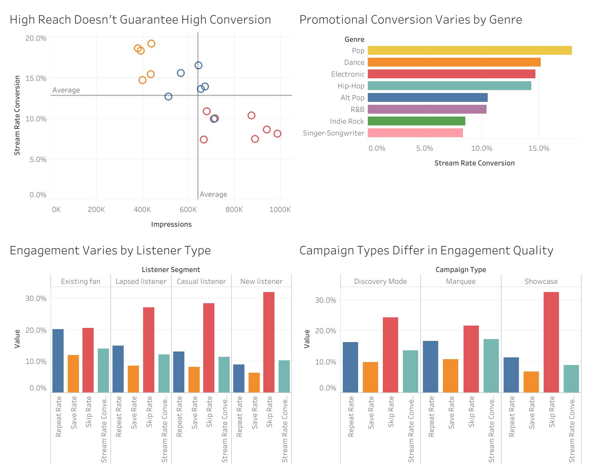

# Music Promotion Product Analytics

Independent product analytics portfolio project using **SQL, Google BigQuery, and Tableau** to evaluate how promotional reach translates into listener engagement.

> **Important:** This project uses fully synthetic data created for portfolio demonstration. It is not Spotify internal data, is not affiliated with Spotify, and should not be interpreted as an estimate of real Spotify product performance.

## Business Question

**Which music-promotion campaigns are most effective at converting listener exposure into meaningful engagement?**

Rather than treating reach as the only success metric, the analysis evaluates both acquisition and downstream listener behavior.

## Tools

- SQL / GoogleSQL
- Google BigQuery
- Tableau

## Dataset

The synthetic dataset contains **24 tracks**, **18 promotion campaigns**, and **4,212 campaign-day-segment-country performance rows**.

See [`data/DATA_DICTIONARY.md`](data/DATA_DICTIONARY.md) for field definitions.

## Core Metrics

| Metric | Definition |
|---|---|
| Stream Conversion Rate | Streams / Impressions |
| Save Rate | Saves / Streams |
| Playlist Add Rate | Playlist Adds / Streams |
| Repeat Rate | Repeat Listeners / Streams |
| Skip Rate | Skips / Streams |

Rates are calculated from aggregated numerators and denominators, rather than by averaging row-level percentages.

## Analysis Workflow

1. Loaded three CSV tables into BigQuery.
2. Joined performance, campaign, and track metadata.
3. Defined product success metrics with `SAFE_DIVIDE`.
4. Compared campaign types, individual campaigns, listener segments, and genres.
5. Used CTEs and benchmark comparisons to flag high-reach / low-conversion campaigns.
6. Used `PERCENT_RANK()` window functions to construct an illustrative overall engagement score.
7. Created a joined BigQuery view as the Tableau source.
8. Built a four-panel dashboard showcasing reach, conversion, audience, and genre patterns.

## Key Findings

- **Reach and efficiency can diverge.** Several high-reach campaigns had below-average stream conversion.
- **Downstream engagement adds important context.** The campaign with the strongest initial conversion was not necessarily the campaign with the strongest repeat behavior by listeners.
- **Listener relationship mattered in the synthetic sample.** Existing fans showed stronger conversion and downstream engagement, while new listeners had higher skip rates.
- **Performance varied by genre.** Because genre sample sizes differ, these results are descriptive rather than causal.

## Tableau Dashboard

The dashboard contains four views:

- **High Reach Doesn’t Guarantee High Conversion**
- **Promotional Conversion Varies by Genre**
- **Engagement Varies by Listener Type**
- **Campaign Types Differ in Engagement Quality**

## SQL Techniques Demonstrated

- Multi-table `JOIN`
- `GROUP BY`
- Aggregations
- `COUNT(DISTINCT ...)`
- `SAFE_DIVIDE`
- `CASE`
- Common Table Expressions (CTEs)
- `CROSS JOIN`
- Window functions with `PERCENT_RANK()`
- BigQuery views

## Limitations

- Data are synthetic.
- Campaign-type comparisons are illustrative only.
- Genre sample sizes differ.
- Observational patterns should not be interpreted causally.
- The composite engagement score uses equal weights and is not validated against a real business objective.

## Product Recommendations

See [`insights/product_recommendations.md`](insights/product_recommendations.md).
